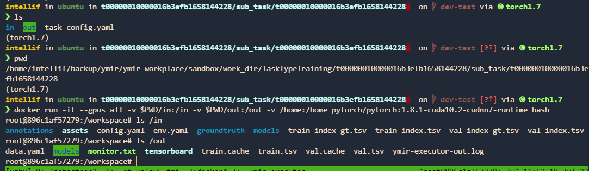

# ymir-executor 使用文档

- [ymir](https://github.com/IndustryEssentials/ymir)

## ymir-1.1.0 official image

- [yolov4](https://github.com/yzbx/ymir-executor-fork#det-yolov4-training)

    ```
    docker pull youdaoyzbx/ymir-executor:ymir1.1.0-yolov4-cu111-tmi
    ```

- [yolov5](https://github.com/yzbx/ymir-executor-fork#det-yolov5-tmi)

    ```
    docker pull youdaoyzbx/ymir-executor:ymir1.1.0-yolov5-cu111-tmi
    ```

- [mmdetection](https://github.com/yzbx/ymir-executor-fork#det-mmdetection-tmi)
    ```
    docker pull youdaoyzbx/ymir-executor:ymir1.1.0-mmdet-cu111-tmi
    ```

- [detectron2](https://github.com/yzbx/ymir-detectron2)

    - [change log](https://github.com/yzbx/ymir-detectron2/blob/master/README.md)

    - ymir1.0.0的镜像与ymir1.1.0兼容

    ```
    docker pull youdaoyzbx/ymir-executor:ymir1.0.0-detectron2-tmi
    ```

- [yolov7](https://github.com/yzbx/ymir-yolov7)

    - [change log](https://github.com/yzbx/ymir-yolov7/blob/main/ymir/README.md)

    ```
    docker pull youdaoyzbx/ymir-executor:ymir1.1.0-yolov7-cu111-tmi
    ```

## det-yolov4-training

- yolov4的训练镜像，采用mxnet与darknet框架，默认的 `Dockerfile` cuda版本为`10.1`，无法在高版本显卡如GTX3080/GTX3090上运行，需要修改dockerfile将cuda版本提升为11.1以上，参考 `cuda112.dockerfile` 进行构建。

  ```
  cd det-yolov4-training
  # cuda101-yolov4-training
  docker build -t ymir-executor/yolov4:cuda101-training -f Dockerfile .

  # cuda112-yolov4-training
  docker build -t ymir-executor/yolov4:cuda112-training -f cuda112.dockerfile .
  ```

## det-yolov4-mining

- yolov4挖掘与推理镜像，与det-yolov4-training对应

```
cd det-yolov4-mining

docker build -t ymir-executor/yolov4:cuda101-mi -f Dockerfile .

docker build -t ymir-executor/yolov4:cuda112-mi -f cuda112.dockerfile .
```

## det-yolov5-tmi

- [change log](./det-yolov5-tmi/README.md)

- yolov5训练、挖掘及推理镜像，镜像构建时会从github上下载权重, 如果访问github不稳定, 建议提前将模型权重下载并在构建时复制到镜像中.

```
cd det-yolov5-tmi
docker build -t ymir-executor/ymir1.1.0:cuda102-yolov5-tmi --build-arg SERVER_MODE=dev --build-arg YMIR=1.1.0 -f cuda102.dockerfile .

docker build -t ymir-executor/ymir1.1.0:cuda111-yolov5-tmi --build-arg SERVER_MODE=dev --build-arg YMIR=1.1.0 -f cuda111.dockerfile .
```

## live-code-executor

- 可以通过`git_url`, `commit id` 或 `tag` 从网上clone代码到镜像并运行, 不推荐使用`branch`, 因为这样拉取的代码可能随时间变化, 实验结果不具备可重复性.

- 参考 [live-code](https://github.com/IndustryEssentials/ymir-remote-git)

```
cd live-code-executor

docker build -t ymir-executor/live-code:torch-tmi -f torch.dockerfile

docker build -t ymir-executor/live-code:mxnet-tmi -f mxnet.dockerfile
```

## det-mmdetection-tmi

- [change log](./det-mmdetection-tmi/README.md)

```
cd det-mmdetection-tmi
docker build -t youdaoyzbx/ymir-executor:ymir1.1.0-mmdet-cu102-tmi -f docker/Dockerfile.cuda102 --build-arg SERVER_MODE=dev --build-arg YMIR=1.1.0 .

docker build -t youdaoyzbx/ymir-executor:ymir1.1.0-mmdet-cu111-tmi -f docker/Dockerfile.cuda111 --build-arg SERVER_MODE=dev --build-arg YMIR=1.1.0 .
```

## 如何制作自己的ymir-executor

- [ymir-executor 制作指南](https://github.com/IndustryEssentials/ymir/blob/dev/docs/ymir-dataset-zh-CN.md)

- [ymir-executor-sdk](https://github.com/yzbx/ymir-executor-sdk) ymir镜像开发辅助库

## 如何导入预训练模型

- [如何导入外部模型](https://github.com/IndustryEssentials/ymir/blob/dev/docs/import-extra-models.md)

    - 通过ymir网页端的 `模型管理/模型列表/导入模型` 同样可以导入模型

---

# FAQ

## apt 或 pip 安装慢或出错

    - 采用国内源，如在docker file 中添加如下命令

        ```
        RUN sed -i 's/archive.ubuntu.com/mirrors.tuna.tsinghua.edu.cn/g' /etc/apt/sources.list

        RUN pip config set global.index-url https://mirrors.aliyun.com/pypi/simple
        ```

## docker build 的时候出错，找不到相应docker file或`COPY/ADD`时出错

    - 回到项目根目录或docker file对应根目录，确保docker file 中`COPY/ADD`的文件与文件夹能够访问，以yolov5为例.

        ```
        cd ymir-executor/det-yolov5-tmi

        docker build -t ymir-executor/yolov5:cuda111 . -f cuda111.dockerfile --build-arg SERVER_MODE=dev
        ```

## 镜像运行完`/in`与`/out`目录中的文件被清理

    - ymir系统为节省空间，会在任务`成功结束`后删除其中不必要的文件，如果不想删除，可以在部署ymir时，修改文件`ymir/command/mir/tools/command_run_in_out.py`，注释其中的`_cleanup(work_dir=work_dir)`。注意需要重新构建后端镜像

        ```
        cd ymir
        docker build -t industryessentials/ymir-backend --build-arg PIP_SOURCE=https://pypi.mirrors.ustc.edu.cn/simple --build-arg SERVER_MODE='dev' -f Dockerfile.backend .

        docker-compose down -v && docker-compose up -d
        ```

## 训练镜像如何调试

    

    - 先通过失败任务的tensorboard链接拿到任务id，如`t000000100000175245d1656933456`

    - 进入ymir部署目录 `ymir-workplace/sandbox/work_dir/TaskTypeTraining/t000000100000175245d1656933456/sub_task/t000000100000175245d1656933456`, `ls` 可以看到以下结果

        ```
        # ls
        in  out  task_config.yaml
        ```

    - 挂载目录并运行镜像`<docker-image-name>`，注意需要将ymir部署目录挂载到镜像中

        ```
        docker run -it --gpus all --shm-size 12G -v $PWD/in:/in -v $PWD/out:/out -v <YMIR_WORKPLACE>:<YMIR_WORKPLACE> <docker-image-name> bash

        # 以/home/ymir/ymir-workplace作为ymir部署目录为例
        docker run -it --gpus all --shm-size 12G -v $PWD/in:/in -v $PWD/out:/out -v /home/ymir/ymir-workplace:/home/ymir/ymir-workplace <docker-image-name> bash
        ```

    - 进入到docker 容器中后, 执行镜像默认的命令, 如dockerfile中写的 `CMD bash /usr/bin/start.sh`

        ```
        bash /usr/bin/start.sh
        ```

    - 推理与挖掘镜像调试同理，注意对应目录均为`ymir-workplace/sandbox/work_dir/TaskTypeMining`

## 模型精度/速度如何权衡与提升

    - 模型精度与数据集大小、数据集质量、学习率、batch size、 迭代次数、模型结构、数据增强方式、损失函数等相关，在此不做展开，详情参考：

        - [Object Detection in 20 Years: A Survey](https://arxiv.org/abs/1905.05055)

        - [Paper with Code: Object Detection](https://paperswithcode.com/task/object-detection)

        - [awesome object detection](https://github.com/amusi/awesome-object-detection)
