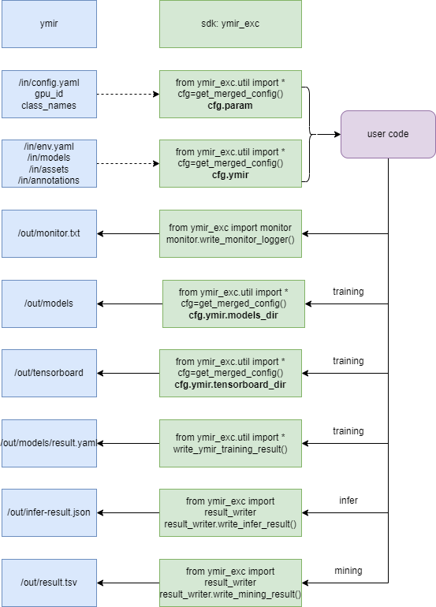

# ymir 用户自定义镜像制作指南

## 目的

此文档面向以下人员：

* 为 ymir 开发训练，挖掘及推理镜像的算法人员及工程人员

* 希望将已经有的训练，挖掘及推理镜像对接到 ymir 系统的算法及工程人员

此文档将详细描述如何使用 ymir executor framework 开发新的镜像。



## 准备工作

1. 下载 ymir 工程 并构建自己的demo镜像：

```
git clone https://github.com/modelai/ymir-executor-fork -b ymir-dev
cd ymir-executor-fork/det-demo-tmi

docker build -t ymir/executor:det-demo-tmi .
```

2. 下载voc dog 数据集

```
sudo apt install wget unzip

wget https://github.com/modelai/ymir-executor-fork/releases/download/dataset/voc_dog_debug_sample.zip -O voc_dog_debug_sample.zip

unzip voc_dog_debug_sample.zip
```
运行上述脚本将得到如下目录
```
voc_dog
├── in  # 输入目录
│   ├── annotations  # 标注文件目录
│   ├── assets  # 图像文件目录
│   ├── train-index.tsv  # 训练集索引文件
│   └── val-index.tsv  # 验证集索引文件
└── out  # 输出目录
```

3. 配置 `/in/env.yaml` 与 `/in/config.yaml`

  * 示例 `voc_dog/in/env.yaml`

  * protocol_version: ymir1.3.0之后添加的字段，说明ymir接口版本

  ```
  task_id: task0
  protocol_version: 1.0.0
  run_training: True
  run_mining: False
  run_infer: False
  input:
      root_dir: /in
      assets_dir: /in/assets
      annotations_dir: /in/annotations
      models_dir: /in/models
      training_index_file: /in/train-index.tsv
      val_index_file: /in/val-index.tsv
      candidate_index_file: /in/candidate-index.tsv
      config_file: /in/config.yaml
  output:
      root_dir: /out
      models_dir: /out/models
      tensorboard_dir: /out/tensorboard
      training_result_file: /out/models/result.yaml
      mining_result_file: /out/result.tsv
      infer_result_file: /out/infer-result.json
      monitor_file: /out/monitor.txt
      executor_log_file: /out/ymir-executor-out.log
  ```

  * 示例 `voc_dog/in/config.yaml`
  ```
  class_names:
  - dog
  export_format: ark:raw
  gpu_count: 1
  # gpu_id: '0,1,2,3'
  gpu_id: '0'
  pretrained_model_params: []
  shm_size: 128G
  task_id: t00000020000020167c11661328921

  # just for test, remove this key in your own docker image
  expected_map: 0.983  # expected map for training task
  idle_seconds: 60  # idle seconds for each task
  ```

4. 运行测试镜像
```
# 交互式运行
docker run -it --rm -v $PWD/voc_dog/in:/in -v $PWD/voc_dog/out:/out ymir/executor:det-demo-tmi bash
> bash /usr/bin/start.sh

# 直接运行
docker run --rm -v $PWD/voc_dog/in:/in -v $PWD/voc_dog/out:/out ymir/executor:det-demo-tmi
```

## ymir 对镜像的调用流程

ymir 通过 mir train / mir mining / mir infer 命令启动镜像，遵循以下步骤：

1. 导出镜像需要用的图像资源以及标注资源文件

2. 准备镜像配置 config.yaml 及 env.yaml

3. 通过 nvidia-docker run 激活镜像，在启动镜像时，将提供以下目录及文件：

| 目录或文件 | 说明 | 权限 |
| --- | --- | --- |
| `/in/env.yaml` | 任务类型，任务 id，数据集索引文件位置等信息 | 只读 |
| `/in/config.yaml` | 镜像本身所用到的超参等标注信息 | 只读 |
| `/in/*-index.tsv` | 数据集索引文件 | 只读 |
| `/in/models` | 预训练模型存放目录 | 只读 |
| `/in/assets` | 图像资源存放目录 | 只读 |
| `/in/annotations` | 标注文件存放目录 | 只读 |
| `/out/tensorboard` | tensorboard 日志写入目录 | 读写 |
| `/out/models` | 结果模型保存目录 | 读写 |

4. 镜像启动以后，完成自己的训练、挖掘或推理任务，将相应结果写入对应文件，若成功，则返回 0，若失败，则返回非 0 错误码

5. ymir 将正确结果或异常结果归档，完成整个过程

## 训练、挖掘与推理镜像的开发工具包 ymir_exc

`app/start.py` 展示了一个简单的镜像执行部分，此文档也将基于这个样例工程来说明如何使用`ymir_exc`来开发镜像。

关于这个文件，有以下部分值得注意：

1. 在 Dockerfile 中，最后一条命令说明了：当此镜像被 ymir 系统通过 nvidia-docker run 启动时，默认执行的是 `bash /usr/bin/start.sh`, 即调用 `python /app/start.py` 命令，也就是此工程中的 `app/start.py` 文件

2. 镜像框架相关的所有内容都在 `ymir_exc` 包中，包括以下部分：

  安装方式 `pip install "git+https://github.com/modelai/ymir-executor-sdk.git@ymir1.3.0"`, 注意通过 ~~`pip install ymir_exc`~~ 的方式安装的版本不具有 `ymir_exc.util` 包。前者在后者的代码基础上进行了扩展，提供了更多的功能(如 `ymir_exc.util`)。

  * `env`：环境，提供任务类型，任务 id 等信息

  * `dataset_reader`：使用数据集读取器来取得数据集信息

  * `result_writer`：写入训练，挖掘以及推理结果

  * `monitor`：写入进度信息

  * `util`: 常用函数, 如`get_merged_config()`

3. 使用 `cfg=util.get_merged_config()` 可以取得默认的 `EasyDict` 实例，这个实例的`cfg.ymir`来源于文件 `/in/env.yaml`，如果出于测试的目的想要更改这个默认文件，可以直接更改 `settings.DEFAULT_ENV_FILE_PATH`，但在实际封装成镜像的时候，应该把它的值重新指回成默认的 `/in/env.yaml`. `cfg.param`则来源于`/in/config.yaml`

4. 在 `start()` 方法中，通过 `cfg.ymir` 中的 `run_training` / `run_mining` / `run_infer` 来判断本次需要执行的任务类型。如果任务类型是本镜像不支持的，可以直接报错

5. 虽然 `app/start.py` 展示的是一个训练，挖掘和推理多合一的镜像，开发者也可以分成若干个独立的镜像，例如，训练一个，挖掘和推理合成一个。实际应用中，镜像可以同时运行推理和挖掘这两个任务，注意其进度与单独运行时不同。

  * 单独运行时，推理或者挖掘的进度值 `percent` 在 [0, 1] 区间，并通过 `monitor.write_monitor_logger(percent)` 记录在 `/out/monitor.txt` 中。

  * 同时运行时， 假设先进行挖掘任务， 那么挖掘的进度值在 [0, 0.5] 区间，推理的进度度值在 [0.5, 1] 区间。

## 训练过程

`app/start.py` 中的函数 `_run_training` 展示了一个训练功能的样例，有以下部分需要注意：

1. 超参的取得

  * 使用 `cfg.param` 取得外部传入的超参数等信息

  * 每个训练镜像都应该准备一个超参模板 `training-template.yaml`，ymir 系统将以此模板为基础提供超参

  * 以下 key 为保留字，将由系统指定：

| key | 类型 | 说明 |
| --- | --- | --- |
| class_names | list | 类别 |
| gpu_id | str | 可使用的 gpu id，以英文逗号分隔，如果为空，则表示用 cpu 训练 |
| pretrained_model_params | list | 预训练模型列表，如果指定了，则表示需要基于此模型做继续训练 |

2. 训练集和验证集的取得：使用 `cfg.ymir.input.training_index_file` 和 `cfg.ymir.input.val_index_file` 取得训练集和验证集的索引文件。索引文件中每一行为图像绝对路径与标注绝对路径，以`\t`进行分隔。
```
from ymir_exc.util import get_merged_config

cfg = get_merged_config()
with open(cfg.ymir.input.training_index_file, 'r') as fp:
    lines = fp.readlines()

for idx, line in enumerate(lines):
    image_path, annotation_path = line.strip().split()
    ...
```

3. 模型的保存

  * 模型按当前正在进行的 stage name，分目录保存

  * 在 `cfg.ymir.output.models_dir` 中提供了模型的保存目录，用户可以使用 pytorch, mxnet, darknet 等训练框架自带的保存方法将模型保存在此目录下的以当前 stage_name 命名的子目录中

    * 例如，如果需要保存 stage_name 为 'epoch-5000' 的模型，则需要把这些模型文件保存到 `os.path.join(cfg.ymir.output.model_dir, 'epoch-5000')` 目录下

  * 推荐使用 `util.write_ymir_training_result()` 方法保存训练结果 (不带目录的模型名称列表，mAP等) ，它对 `result_writer.write_model_stage()` 进行了封装，兼容性与容错性更好。

  * 需要保存的模型实际记录在`cfg.ymir.output.training_result_file`中，ymir将依据此文件进行文件打包，供用户下载、迭代训练及推理挖掘。

4. 进度的记录：使用 `monitor.write_monitor_logger(percent)` 方法记录任务当前的进度，实际使用时，可以每隔若干轮迭代，根据当前迭代次数和总迭代次数来估算当前进度（一个 0 到 1 之间的数），调用此方法记录

## 挖掘过程

所谓挖掘过程指的是：提供一个基础模型，以及一个不带标注的候选数据集，在此候选数据集上进行 active learning 算法，得到每张图片的得分，并将这个得分结果保存。

`app/start.py` 中的函数 `_run_mining` 展示了一个数据挖掘过程的样例，有以下部分需要注意：

1. 参数的取得

  * 使用 `cfg = get_merged_config()` 取得外部传入的参数 `cfg.param`

  * 每个挖掘镜像都应该准备一个参数模板 `mining-template.yaml`，ymir 系统将以此模板为基础提供参数

  * 以下 key 为保留字，将由系统指定：

| key | 类型 | 说明 |
| --- | --- | --- |
| class_names | list | 类别 |
| gpu_id | str | 可使用的 gpu id，以英文逗号分隔，如果为空，则表示用 cpu 训练 |
| model_params_path | list | 模型路径列表，镜像应该从里面选择自己可以使用的模型，如果有多个模型可以使用，直接报错 |

2. 候选集的取得

  * 进行挖掘任务时，所使用的数据集是一个没有带标注的候选集，可以使用 `cfg.ymir.input.candidate_index_file` 取得挖掘数据集的索引文件，这个文件中每一行为图片的绝对路径。

  ```
  with open(cfg.ymir.input.candidate_index_file, 'r') as fp:
      lines = fp.readlines()

  for line in lines:
      image_path = line.strip()
      ...
  ```

3. 结果的保存

  * 使用 `result_writer.write_mining_result()` 对挖掘结果进行保存, 结果将保存到`cfg.ymir.output.mining_result_file`，ymir将依据这个文件进行新数据集生成。

## 推理过程

所谓推理过程指的是：提供一个基础模型，以及一个不带标注的候选数据集，在此候选数据集上进行模型推理，得到每张图片的 detection 结果（框，类别，得分），并保存此结果。

`app/start.py` 中的函数 `_run_infer` 展示了一个推理过程的样例，有以下部分需要注意：

1. 参数的取得：同数据挖掘过程

2. 候选集的取得：同数据挖掘过程, 也是利用文件 `cfg.ymir.input.candidate_index_file`

3. 结果的保存

  * 推理结果本身是一个 dict，key 是候选集图片的路径，value 是一个由 `result_writer.Annotation` 构成的 list

  * 使用 `result_writer.write_infer_result()` 保存推理结果, 推理结果将保存到`cfg.ymir.output.infer_result_file`, ymir将依据这个文件进行结果展示与新数据集生成。

## 镜像打包

可以在 `Dockerfile` 的基础上构建自己的打包脚本

## 测试

可以使用以下几种方式进行测试：

1. 通过 [ymir-executor-verifier](https://github.com/modelai/ymir-executor-verifier) 进行测试

2. 通过 ymir web 系统进行测试

3. 通过 ymir 命令行启动 mir train / mir mining / mir infer 命令进行测试


