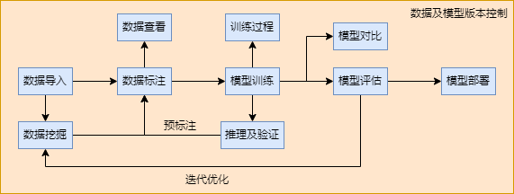

# 设计文档

本文档介绍ymir平台调用镜像的过程

- 镜像是ymir平台的核心组件，ymir平台通过调用镜像实现模型训练，推理及挖掘功能。

- 用户可以通过使用不同的镜像，满足不同场景的速度、精度及部署要求。



## 新增镜像

- 即 `镜像管理/我的镜像/新增镜像`

- 新增镜像时，ymir平台将根据镜像地址解析镜像中/img-man下的四个yaml文件

```
training-template.yaml
mining-template.yaml
infer-template.yaml
manifest.yaml
```

- 如果镜像地址在本地不存在， 将会调用 `docker pull` 进行下载， 由于docker hub在国外，有时可能因网络原因而失败。可以尝试[镜像代理加速](https://dockerproxy.com/)

- training-template.yaml 中包含训练任务的默认超参数

- mining-template.yaml 中包含挖掘任务的默认超参数

- infer-template.yaml 中包含推理任务的默认超参数

- manifest.yaml 指明镜像的目标类型，是目标检测、语义分割还是实例分割镜像

## 模型训练

- 在ymir平台选择好训练镜像， 训练集， 训练目标， 验证集， 预训练模型， GPU数量 及 超参数。 ymir平台将建立 in 与 out 目录， 并挂载到镜像中的 /in 与 /out 目录

### in 目录内容

- 训练集与验证集图片：训练集与验证集的图片均会通过软链接的方式将根目录链接到 in/assets, 对应图片的路径输出到 in/train-index.tsv 与 in/val-index.tsv

- 训练集与验证集标注：ymir平台将根据超参数中的`export_format`决定标注的格式， 参考[数据集格式](../overview/dataset-format.md)

- 训练目标：ymir平台将训练目标附加到超参数中的 `class_names` 字段

- GPU数量：ymir平台自动选择空闲的GPU(如显存占用率<30%)，进行gpu_id映射后， 附加到超参数中的 `gpu_ids` 字段

- 预训练模型：ymir平台会将预训练模型解压到 in/models, 并将其中的文件路径附加到超参数中的 `pretrained_model_params` 字段

- 超参数：ymir平台将在网页上显示 training-template.yaml 中的默认超参数， 用户修改后，将与上面附加的字段一起保存到 in/config.yaml

### out 目录内容

- 镜像运行需要产生 /out/monitor.txt， /out/tensorboard/xxx 及 /out/models/result.yaml

- models目录中存在模型权重及训练结果文件/out/models/result.yaml, ymir平台将依据result.yaml打包权重, 显示模型精度。

- ymir平台将链接tensorboard目录到 out/tensorboard, 镜像的训练日志需要保存在此

- 镜像训练的进度(0到1之间)需要实时写到/out/monitor.txt， ymir平台依此在页面上显示进度，估计剩余时间。

### in out 目录内容示例

```
.
├── in
│   ├── annotations [257 entries exceeds filelimit, not opening dir]
│   ├── assets -> /home/ymir/ymir/ymir-workplace/sandbox/0001/training_asset_cache
│   ├── config.yaml
│   ├── env.yaml
│   ├── models
│   ├── train-index.tsv
│   └── val-index.tsv
├── out
│   ├── models [29 entries exceeds filelimit, not opening dir]
│   ├── monitor.txt
│   ├── tensorboard -> /home/ymir/ymir/ymir-workplace/ymir-tensorboard-logs/0001/t00000010000028774b61663839849
│   └── ymir-executor-out.log
└── task_config.yaml
```

### result.yaml 示例
```
best_stage_name: epoch2
mAP: 0.5509647407646582
model_stages:
  epoch1:
    files:
    - epoch1.pt
    mAP: 0.2869113044394813
    stage_name: epoch1
    timestamp: 1663839980
  epoch2:
    files:
    - epoch2.pt
    mAP: 0.5509647407646582
    stage_name: epoch2
    timestamp: 1663840020
```

## 模型推理与挖掘

- 大致上与模型训练类似, 下面是不同点

### in 目录内容

- 推理集/挖掘集图片：图片均会通过软链接的方式将根目录链接到 in/assets, 对应径均输出到 in/candidate-index.tsv

- 预训练模型：ymir平台会将预训练模型解压到 in/models, 并将其中的文件路径附加到超参数中的 `model_params_path` 字段

### out 目录内容

- 模型推理需要产生 /out/monitor.txt 与 /out/infer-result.json

- 模型挖掘需要产生 /out/monitor.txt 与 /out/result.tsv
