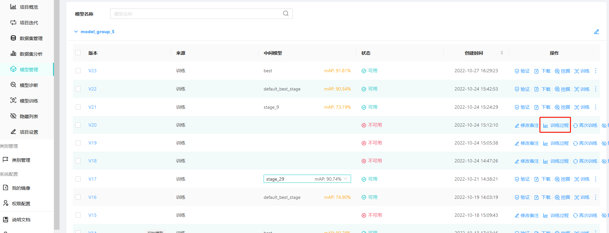
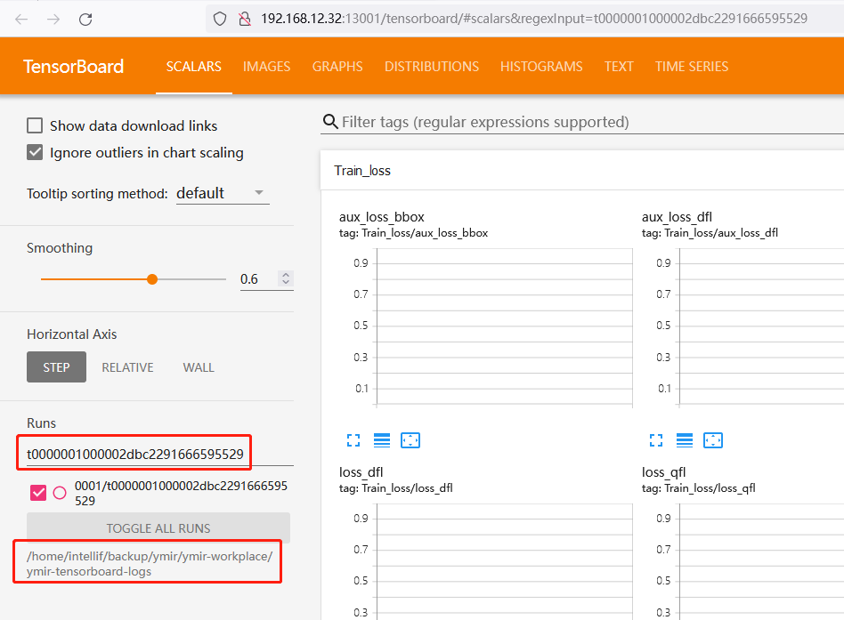

# docker 镜像调试

假设所有本地代码放在 $HOME/code 下, 以 `youdaoyzbx/ymir-executor:ymir2.0.0-yolov5-cu111-tmi` 为例

## 基于 voc dog 数据集进行调试

1. 下载数据集并进行预处理, [参考脚本](https://github.com/modelai/ymir-executor-verifier/blob/main/start.sh)

```
set -e

echo "download voc dog dataset"
wget https://github.com/modelai/ymir-executor-fork/releases/download/dataset/voc_dog_debug_sample.zip -O voc_dog_debug_sample.zip

echo "unzip voc dog dataset"
unzip voc_dog_debug_sample.zip

echo "generate candidate-index.tsv for mining and infer"
cd voc_dog/in && cat val-index.tsv | awk '{print $1}' > candidate-index.tsv

echo "download env.yaml"
wget https://raw.githubusercontent.com/modelai/ymir-executor-verifier/main/tests/configs/env.yaml -O env.yaml

echo "download demo yolov5 config.yaml"
wget https://raw.githubusercontent.com/modelai/ymir-executor-verifier/main/tests/configs/config.yaml
```

得到以下目录，注意根据训练镜像修改 `config.yaml`

```
voc_dog
├── in
│   ├── annotations [标注文件夹]
│   │   ├── train [ymir后台不会按照train/val进行文件夹划分，请按train-index.tsv获取训练集]
│   │   └── val [ymir后台不会按照train/val进行文件夹划分，请按val-index.tsv获取测试集]
│   ├── assets [图片文件夹]
│   │   ├── train [ymir后台不会按照train/val进行文件夹划分，请按train-index.tsv获取训练集]
│   │   └── val [ymir后台不会按照train/val进行文件夹划分，请按val-index.tsv获取训练集]
│   ├── candidate-index.tsv
│   ├── config.yaml [ymir后台提供的超参数文件]
│   ├── env.yaml [ymir后台提供的路径文件]
│   ├── models [ymir后台提供的预训练模型存放目录]
│   ├── train-index.tsv
│   └── val-index.tsv
└── out [12 entries exceeds filelimit, not opening dir]

9 directories, 5 files
```

2. 交互式启动镜像并运行 `$HOME/code/start.py` 文件进行调试

```
docker run -it --gpus all --shm-size 128G -v $PWD/voc_dog/in:/in -v $PWD/voc_dog/out:/out -v $HOME/code:/code youdaoyzbx/ymir-executor:ymir2.0.0-yolov5-cu111-tmi bash

cd /code
python start.py
```

## 基于 ymir 发起的训练任务进行调试

假设某个训练任务失败了， 可通过tensorboard获取对应的 task_id 与 ymir-workspace.

1. 进入项目的模型管理，跳转到失败任务的训练过程


2. 获取失败任务的 `task_id: t0000001000002dbc2291666595529` 与 ymir后台工作目录 `ymir-workspace: /home/intellif/backup/ymir/ymir-workplace`


3. 进行失败任务的目录
```
YMIR_WORKDIR=/home/intellif/backup/ymir/ymir-workplace
TASK_ID=t0000001000002dbc2291666595529
cd $YMIR_WORKDIR/sandbox/work_dir/TaskTypeTraining/$TASK_ID/sub_task/$TASK_ID
ls

# 将输出 in  out  task_config.yaml
```

4. 其中 in 有以下目录结构：
```
in
├── annotations
│   └── index.tsv
├── assets -> /home/intellif/backup/ymir/ymir-workplace/sandbox/0001/asset_cache
├── config.yaml
├── env.yaml
├── models
├── prediction
├── predictions
│   └── index.tsv
├── pred-test-index.tsv
├── pred-train-index.tsv
├── pred-val-index.tsv
├── test-index.tsv
├── train-index.tsv
└── val-index.tsv
```

5. 其中 out 有以下文件:

```
out
├── monitor.txt
├── tensorboard -> /home/intellif/backup/ymir/ymir-workplace/ymir-tensorboard-logs/0001/t0000001000002dbc2291666595529
└── ymir-executor-out.log
```

6. 交互式启动镜像进行调试

注：其中`in/assets` 为软链接，为确保在镜像中该软链接有效，需要将 `ymir-workspace` 挂载到镜像中对应位置

```
docker run -it --gpus all --shm-size 128G -v $PWD/in:/in -v $PWD/out:/out -v $YMIR_WORKDIR:$YMIR_WORKDIR -v $HOME/code:/code youdaoyzbx/ymir-executor:ymir2.0.0-yolov5-cu111-tmi bash
```

7. 推理与挖掘镜像调试同理，注意对应目录均为 `ymir-workplace/sandbox/work_dir/TaskTypeMining`

## 调试完成后构建新镜像

- 准备 `zzz.dockerfile`

```
FROM youdaoyzbx/ymir-executor:ymir2.0.0-yolov5-cu111-tmi

# 当$HOME/code目录下的代码文件复制到/app
WORKDIR /app
COPY . /app/

# 如果更新了超参数配置文件，复制到/img-man
# COPY ./img-man/*.yaml /img-man/

# 如果改变了入口函数, 对应修改 /usr/bin/start.sh的内容
RUN echo "python3 /app/start.py" > /usr/bin/start.sh
CMD bash /usr/bin/start.sh
```

- 进行构建

```
docker build -t youdaoyzbx/ymir-executor:ymir2.0.1-yolov5-cu111-tmi . -f zzz.dockerfile
```

## ymir后台错误查看

- 在`ymir-workplace/ymir-data/logs`下查看

```
tail -f -n 200 ymir_controller.log
```
