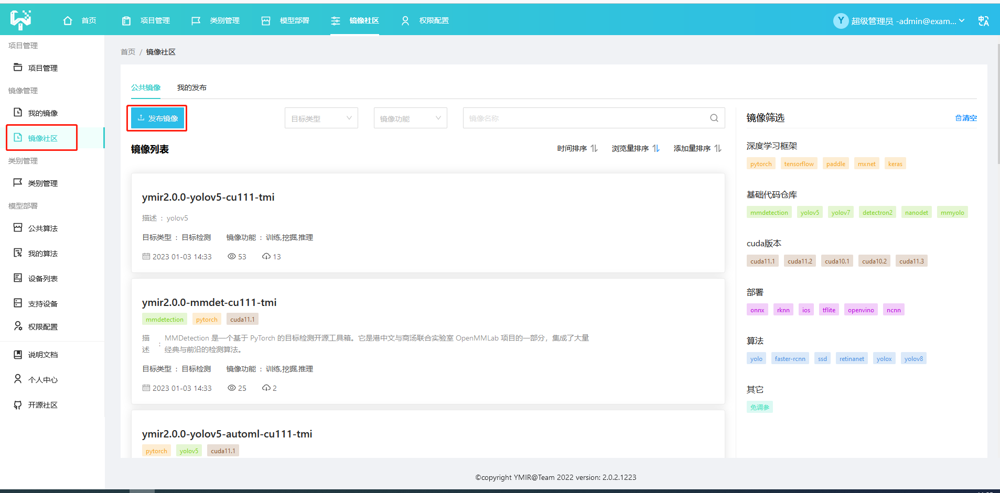
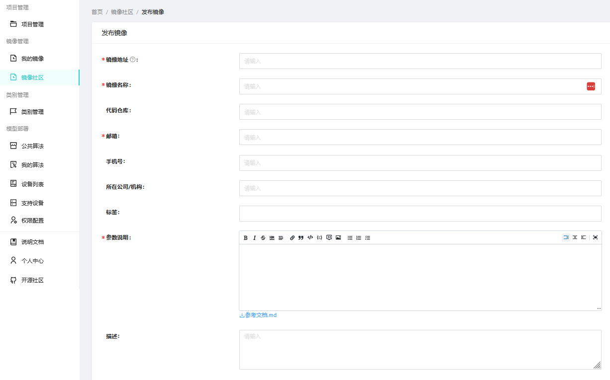

# 镜像社区

- [镜像社区](http://pubimg.vesionbook.com:8110/img)的目的是共享用户之间制作的镜像，增加用户的可用镜像。



- 用户通过ymir平台可使用与发布镜像



### 将镜像上传到docker hub
可以参考[runoob/docker](https://www.runoob.com/docker/docker-repository.html)，其发布流程与`git`类似。

- 在[docker hub](https://hub.docker.com/) 上注册帐号，假设用户名 `<username> = youdaoyzbx`

- 将本地镜像 `xxx/xxx:xxx` 添加别名，改为 `<username>/xxx:xxx` 的格式
```
docker pull ubuntu18.04
docker tag ubuntu:18.04 youdaoyzbx/ubuntu:18.04
```
- login 到docker hub并上传
```
docker login
docker push youdaozbx/ubuntu:18.04
```

### 在ymir平台进行发布

- 镜像地址：填写 `<username>/xxx:xxx`, 需要上传到docker hub

- 填写其它信息与[参数说明](./det-yolov5-tmi.md)

- 点击确定并等待Ymir团队审核
