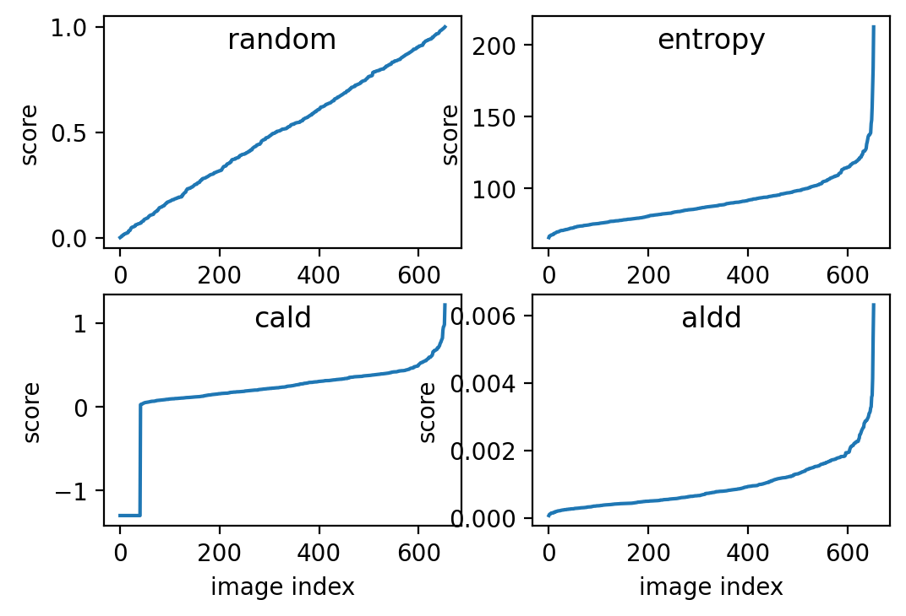

# ymir mining images overview

| docker images | random | cald | aldd | entropy |
| - | - | - | - | - |
| yolov5 | ✔️ | ✔️ | ✔️ | ✔️ |
| mmdetection | ✔️ | ✔️ | ✔️ | ✔️ |
| yolov4 | ❌ | ✔️ | ✔️ | ❌ |
| yolov7 | ❌ | ❌ | ✔️ | ❌ |
| nanodet | ❌ | ❌ | ✔️ | ❌ |
| vidt |❌ | ✔️ | ❌ | ❌ |
| detectron2 | ❌ | ✔️ | ❌ | ❌ |

# 带负样本的单类挖掘实验

- view [ALBench: Active Learning Benchmark](https://github.com/modelai/ALBench) for detail

## 实验设置

COCO数据集中选择三个类做实验，分别是Train，Fork，Dog，从选定类别的train中选择1000张图片加入训练集，从不包含该类别的图片中选择3000张作为负样本加入训练集。选定类别的所有val加入验证集，从不包含该图片的val中选择3倍数据作为负样本加入验证集。剩余图片全部加入挖掘集，每次迭代从中选择500图片加入训练集。

| class | train | val | mining |
| - | - | - | - |
| train(火车) | 4000 | 628 | 114287 |
| fork(叉子) | 4000 | 620 | 114287 |
| dog(狗) | 4000 | 708 | 114287 |

## 挖掘实验结果

| class | mining algorithm | iter 0 | iter 1 | iter 2 | iter 3 | iter 4 |
| - | - | - | - | - | - | - |
| train(火车) | random | 0.647 | 0.639 | 0.652 | 0.620 | 0.622 |
| train(火车) | entropy | 0.678 | 0.703 | 0.721 | 0.738 | 0.757 |
| train(火车) | aldd | 0.665 | 0.706 | 0.738 | 0.754 | 0.778 |
| fork(叉子) | random | 0.244 | 0.221 | 0.224 | 0.227 | 0.225 |
| fork(叉子) | entropy | 0.239 | 0.255 | 0.313 | 0.367 | 0.372 |
| fork(叉子) | aldd | 0.220 | 0.290 | 0.329 | 0.368 | 0.379 |
| dog(狗) | random | 0.391 | 0.418 | 0.401 | 0.389 | 0.416 |
| dog(狗) | entropy | 0.391 | 0.418 | 0.449 | 0.535 | 0.505 |
| dog(狗) | aldd | 0.399 | 0.487 | 0.518 | 0.533 | 0.564 |

## reference

- [awesome-active-learning](https://github.com/baifanxxx/awesome-active-learning)

- entropy: `Multi-class active learning for image classification. CVPR 2009`

- [CALD](https://github.com/we1pingyu/CALD/): `Consistency-based Active Learning for Object Detection. CVPR 2022 workshop`

- [ALDD](https://gitlab.com/haghdam/deep_active_learning): `Active Learning for Deep Detection Neural Networks. ICCV 2019`
