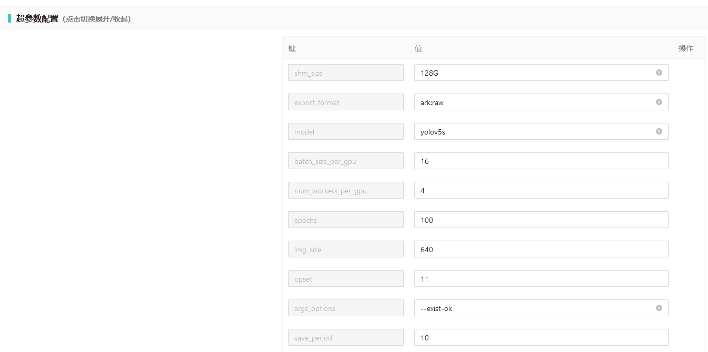

# Ymir镜像超参数

- ymir平台为每个镜像提供通用的参数，同时每个镜像按任务拥有相应的训练、推理及挖掘功能参数。

- 部分通用参数由ymir平台自动生成，剩余通用参数可以手动修改。

- 默认功能参数由镜像提供，用户可以手动修改功能参数。

- 从镜像的角度，通用参数与功能参数均以 [yaml格式](https://www.runoob.com/w3cnote/yaml-intro.html) 存储在镜像中的 `/in/config.yaml`

{!docs/sample_files/in_config.md!}

## ymir平台的通用参数

- gpu_count： 用户可在启动任务中进行修改

- gpu_id: ymir平台根据gpu_count自动生成

- task_id: ymir平台自动生成

- class_names: ymir平台根据用户选择自动生成

- shm_size: 用户可在`超参数配置`页面中手动修改

- export_format: 用户可在`超参数配置`页面中手动修改

- pretrained_model_params: ymir平台根据用户选择自动生成

- model_params_path: ymir平台根据用户选择自动生成

### gpu_count

ymir平台为镜像提供的显卡数量

```
gpu_count: 0 # 表示不使用显卡，即仅使用cpu
gpu_count: 2 # 表示使用 2 块显卡
```

### gpu_id

ymir 平台为镜像提供的gpu编号，编号从0开始，但实际上使用的显卡为当前空闲显存超过80%的随机显卡。

```
gpu_id: '0' # 采用一块显卡，实际上可能使用编号为5, 6的显卡。
gpu_id: '0, 1' # 采用两块显卡，实际上可能使用编号为1和8的显卡，或者使用编号为3和5的显卡。
```

!!! 注意
    对于镜像而言，直接使用 `gpu_id` 对应的显卡即可，不需要考虑 `CUDA_VISIBLE_DEVICES`等变量。 ymir平台在启动镜像时通过`--gpus '"device=5,7"'`指定使用编号为5, 7的显卡，但实际镜像中只能使用编号 `0, 1`，其效果如下。

```
> docker run --gpus '"device=5,7"' nvidia/cuda:10.1-cudnn7-devel-ubuntu16.04 nvidia-smi
Thu Jan 12 06:19:03 2023
+-----------------------------------------------------------------------------+
| NVIDIA-SMI 465.31       Driver Version: 465.31       CUDA Version: 11.3     |
|-------------------------------+----------------------+----------------------+
| GPU  Name        Persistence-M| Bus-Id        Disp.A | Volatile Uncorr. ECC |
| Fan  Temp  Perf  Pwr:Usage/Cap|         Memory-Usage | GPU-Util  Compute M. |
|                               |                      |               MIG M. |
|===============================+======================+======================|
|   0  NVIDIA GeForce ...  On   | 00000000:86:00.0 Off |                  N/A |
| 22%   31C    P8     1W / 250W |      0MiB / 11019MiB |      0%      Default |
|                               |                      |                  N/A |
+-------------------------------+----------------------+----------------------+
|   1  NVIDIA GeForce ...  On   | 00000000:8A:00.0 Off |                  N/A |
| 22%   29C    P8     5W / 250W |      0MiB / 11019MiB |      0%      Default |
|                               |                      |                  N/A |
+-------------------------------+----------------------+----------------------+
```

### task_id

任务 id, 可以唯一确定某项任务， 如 `t000000100000208ac7a1664337925`

### class_names

数据集的类别名称

```
class_names: ['cat', 'dog']  # 任务目标中包含cat和dog
class_names: ['cat']  # 任务目标中仅包含cat
```

### shm_size

ymir平台为镜像提供的共享内存大小，对于ymir2.0.0后的版本，默认的共享内存为 `16G` 乘以 `gpu_count`。而ymir2.0.0之前的版本，默认的共享内存固定为 `16G`。

```
shm_size: 128G  # 为镜像提供128G共享内存
shm_size: 256G  # 为镜像提供256G共享内存
```

!!! 注意
    共享内存过小时，会报 `Out of Memory`的错误，即内存不足错误。可以考虑减少`gpu_count`，`batch size`, `num_workers` 或 增加 `shm_size`。服务器的共享内存可以通过 `df -h` 查看，下面服务器的共享内存为 `63G`

```
> df -h | grep shm
Filesystem                   Size  Used Avail Use% Mounted on
tmpfs                         63G     0   63G   0% /dev/shm
```

### export_format

ymir平台为训练任务导出的图像及标注格式, 详情参考 [数据集格式](./dataset-format.md)

- 图像格式：`['raw']`, `raw` 代表常用的图片存储格式，如 `jpg`。

- 标注格式：`["ark", "voc", "det-ark", "det-voc", "seg-coco"]`, 其中 `ark` 与 `det-ark` 为同一种目标检测格式，标注文件为txt文件；`voc`与`det-voc`为同一种目标检测格式，标注文件为xml文件；`seg-coco`为语义分割与实例分割的格式，标注文件为[coco格式](https://cocodataset.org/#format-data)的json文件。

```
export_format: ark:raw  # 类似 yolov5 的目标检测格式, 标注文件为txt格式
export_format: det-voc:raw  # 类似 voc 目标检测格式，标注文件为xml格式
export_format: seg-coco:raw  # 类似 coco 的语义分割或实例分割的格式，标注文件为json格式
```

!!! 注意
    仅对训练任务起作用，对于推理或挖掘任务，此参数不起作用

### pretrained_model_params

- ymir平台为训练任务对应镜像提供的参数，其中包含预训练文件的绝对路径。对应[训练配置](https://github.com/IndustryEssentials/ymir/wiki/%E6%93%8D%E4%BD%9C%E8%AF%B4%E6%98%8E#%E8%AE%AD%E7%BB%83%E9%85%8D%E7%BD%AE)中的预训练模型。
- 预训练模型文件对应训练任务的输出文件，可以包含任意文件，如配置文件等，不局限于权重文件。

```
pretrained_model_params: ['/in/models/a.pth', '/in/models/b.pth', '/in/models/a.py']
```

!!! 注意
    对于推理或挖掘任务，此参数不提供


### model_params_path

- ymir平台为推理或挖掘任务对应镜像提供的参数，其中包含权重文件的绝对路径，对应[模型推理](https://github.com/IndustryEssentials/ymir/wiki/%E6%93%8D%E4%BD%9C%E8%AF%B4%E6%98%8E#%E6%A8%A1%E5%9E%8B%E6%8E%A8%E7%90%86) 或 [数据挖掘](https://github.com/IndustryEssentials/ymir/wiki/%E6%93%8D%E4%BD%9C%E8%AF%B4%E6%98%8E#%E6%95%B0%E6%8D%AE%E6%8C%96%E6%8E%98) 中选择的模型。

```
model_params_path: ['/in/models/a.pth', '/in/models/b.pth', '/in/models/a.py']
```

!!! 注意
    对于训练任务，此参数不提供

## 任务超参数

### 训练任务超参数

镜像可以通过 `/img-man/training-template.yaml` 向ymir平台暴露训练任务的超参数， 以`youdaoyzbx/ymir-executor:ymir2.0.0-yolov5-cu111-tmi`镜像为例，它的训练任务超参数配置文件如下：

- 训练任务超参数配置文件: 镜像中的 `/img-man/training-template.yaml`

```
shm_size: '128G'
export_format: 'ark:raw'
model: 'yolov5s'
batch_size_per_gpu: 16
num_workers_per_gpu: 4
epochs: 100
img_size: 640
opset: 11
args_options: '--exist-ok'
save_best_only: True  # save the best weight file only
save_period: 10
sync_bn: False  # work for multi-gpu only
activation: 'SiLU'  # view https://pytorch.org/docs/stable/nn.html#non-linear-activations-weighted-sum-nonlinearity
```

- ymir平台对应的超参数编辑页面, 编辑页面与配置文件一一对应。



### 推理任务超参数

- 推理任务超参数配置文件: 镜像中的 `/img-man/infer-template.yaml`


### 挖掘任务超参数

- 挖掘任务超参数配置文件: 镜像中的 `/img-man/mining-template.yaml`

### 常用任务超参数

- epochs: 整数，如 100, 表示在训练任务中，整个数据集循环的次数。epochs 越大，数据集越大，训练时间越长。

    - 类似的参数有 `max_epochs`, `num_epochs`，表达的意思相同。

- steps: 整数，如20000，表示训练任务中，训练步骤循环的次数。steps越大，训练时间越长。

    - 类似的参数有 `max_steps`, `num_steps`, `iters`, `max_iters`, `num_iters`

    - `steps = epochs * dataset_size / batch_size`

- batch_size: 整数，批量大小，如 8。由于数据集往往上万张，计算机无法一次性全部加载到内存或显存中，因此在处理时，可以一次处理 8 张。

    - 类似的参数有 `batch`, `num_batch`。

    - 对于支持分布式处理的镜像， `batch_size_per_gpu` 与 `num_images_per_gpu` 乘以 使用的GPU数(gpu_count)，则为实际的 batch_size。

- num_workers: 整数，数据加载时使用的进程数，设置为0则是采用单进程进行加载，一般设置为4 或 8。

    - 类似的参数有： `workers`

    - 对于支持分布式处理的镜像， `num_workers_per_gpu` 乘以使用的GPU数(gpu_count), 则为实际的 num_workers。
