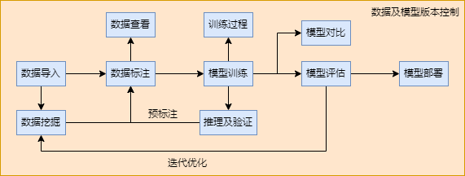

# YMIR简介

YMIR是一款专为规模化生产而设计的AI平台，旨在为算法开发和标注人员提供端到端的算法研发工具。YMIR平台可以将企业的数据和模型进行平台化管理，降低算法开发和维护成本，提高数据标注和模型训练效率。除了数据标注、模型训练和模型部署功能外，YMIR还提供以下特色功能：

1. 数据挖掘功能：YMIR利用主动学习算法，可以挖掘高质量数据，并仅使用10%的标注量即可获得接近100%标注的精度。

2. 数据和模型版本管理：YMIR系统可以对数据和模型进行版本管理，支持历史追溯和复现。

3. 项目划分：每个项目都具有固定的标签集，用户可以在同一项目中进行数据操作和模型训练，产生多个数据和模型版本，并对不同版本的数据和模型进行对比分析，提高工作效率。

4. 可视化：YMIR支持对数据、模型训练、模型推理和模型评估进行可视化，方便用户理解和把控AI算法生产的所有环节。



# 安装简介

详情参考[官方安装说明](https://github.com/IndustryEssentials/ymir/blob/master/README_zh-CN.md#2-%E5%AE%89%E8%A3%85)

## 服务器系统

- 推荐使用 ubuntu 18.04, 使用ubuntu 22.04+ 可能会出现glibc缺失的问题。

## nvidia驱动

- 推荐使用 Nvidia dirver >= 510.47.03, 以支持cuda11.6及以下镜像

```
# 测试命令
nvidia-smi
```

## docker & docker compose

- 推荐使用 docker >= 20.10, 安装参考[docker install](https://docs.docker.com/engine/install/ubuntu/)

- 推荐使用 docker compose >= 1.29.2

```
# 安装docker engine, 此方式经过第三方，可能有风险
curl -sSL https://get.daocloud.io/docker | sh

# 安装docker compose
pip3 install docker-compose

# 普通用户添加docker权限，重启生效
sudo groupadd docker
sudo usermod -aG docker $USER

# 测试普通用户使用docker
docker run hello-world

# 查看docker-compose版本
docker-compose version
```

## nvidia-docker

- [安装参考](https://docs.nvidia.com/datacenter/cloud-native/container-toolkit/install-guide.html#installation-guide)

```
# 测试命令
docker run --rm --runtime=nvidia --gpus all nvidia/cuda:11.6.2-base-ubuntu20.04 nvidia-smi
```

## ymir安装命令

- 安装并开启服务
```
git clone git clone https://github.com/IndustryEssentials/ymir.git
bash ymir.sh start
```

- 安装完成后，直接访问 http://localhost:12001 即可显示登录界面， 默认用户名为admin@example.com, 密码为12345678

- 停止服务
```
bash ymir.sh stop
```

